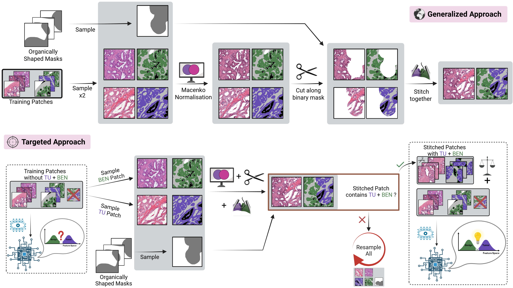

# Patch Stitching Repository

A Python repository for generating composite histopathology image patches by stitching two image–mask pairs along organically shaped binary masks. 

It supports the two approaches described in our paper "Patch engineering as an effective data augmentation strategy in low-resource annotation algorithm development". (Put link when publicated)




The **Generalized Approach** producing stitched patches sampled at random or the **Targeted Approach** producing stitched patches to enrich a dataset with underrepresneted class co-occurences. The **Targeted Approach** can be configured in two different modes:
- **Targeted_Filter**: Provide a list of class co-occurences that you want to produce. Only stitched patches that contain a class co-occurences in that list will be kept.
- **Targeted_Matrix**: Generate exactly specified counts for each class–class pairing.

---
## 🧭 Choosing a Patch-Engineering Strategy

| Typical situation | Recommended mode | Rationale |
|-------------------|------------------|-----------|
| You just need *more* realistic mixed-class patches and **don’t know which boundaries are scarce** | **`generalized`** | Takes any two random patches → quick, no extra parameters. |
| You **know** the boundary the model struggles with (e.g. TUMOR ↔ BENIGN) but exact counts are irrelevant | **`targeted_filter`** | Keeps only stitched patches that contain at least one pair from your `filter_pairs`; fastest way to up-sample specific boundaries.|
| You need **strict, reproducible counts** per boundary (e.g. balanced benchmark) | **`targeted_matrix`** | Generates precisely the quota you define in the upper-triangular `matrix`. |

### Quick decision flow

1. **Unsure which transitions are missing?** → `generalized`  
2. **Know the weak boundaries but fine with “~roughly more” of them?** → `targeted_filter`  
3. **Need exact numbers per boundary?** → `targeted_matrix`

### Examples of all modes


---

## 📋 Table of Contents

1. [Prerequisites](#prerequisites)
5. [Configuration](#configuration)
6. [Usage](#usage)
7. [Examples](#examples)
8. [License](#license)

---

## Prerequisites
1. Install python packages needed
- Numpy 
- pickle
- Python Image Library (PIL)
- subprocess and multiprocessing
- pyyaml
- json 
- staintools (see https://github.com/Peter554/StainTools for installation guide)

2. Unpack `BinaryMasks.tar.gz` to a location of your choice to use as stitching masks

---

## Configuration

Each parameter lives in `config.yaml`. Below is a description of every field. We assume that images and masks are in different folders and have the same names except their extensions. Masks are assumed to be `.png` and images to be `.jpg`. Otherwise very small code modifications are necessary.

### Shared parameters (all modes)

| Parameter             | Type       | Description                                                                                     |
|-----------------------|------------|-------------------------------------------------------------------------------------------------|
| `mode`                | string     | Operation mode. One of `generalized`, `targeted_filter`, or `targeted_matrix`.                                         |
| `seed`                | integer    | Base RNG seed for all sampling, ensuring reproducibility.                                       |
| `cpus`                | list[int]  | CPU core indices for pinning workers (e.g. `[0,1,2]`).                                          |
| `m_norm_img`          | string     | Filepath to a reference image used to fit the Macenko normalizer.                              |
| `data_root`           | string     | Root directory containing your training dataset hierarchy.                                      |
| `mask_dir_name`       | string     | Subfolder under `data_root` where mask PNGs are stored (default: `mask_FINAL`).                |
| `image_dir_name`      | string     | Subfolder under `data_root` for image JPGs (default: `image`).                                   |
| `stitch_masks`        | string     | Directory of binary stitch masks used for creating boundaries.                                  |
| `output_dir`          | string     | Directory where the generated stitched images (`image/`) and masks (`mask_FINAL/`) will be saved.|
| `norm_pickle`         | string     | _Optional_; path to save/load the fitted Macenko normalizer. Defaults to `<output_dir>/macenko_normalizer.pkl`.|

### Generalized mode parameters (`mode: generalized`)

| Parameter     | Type    | Description                                                |
|---------------|---------|------------------------------------------------------------|
| `n_patches`   | integer | Number of random stitched patches to generate.             |

### Targeted_Filter mode parameters (`mode: targeted_filter`)

| Parameter              | Type          | Description                                                            |
|------------------------|---------------|------------------------------------------------------------------------|
| `n_patches`            | integer       | Number of stitched patches to generate.                                 |
| `filter_pairs`         | list[list[int]] | List of 2‑element lists specifying class pairs to include, e.g. `[[1,2],[3,4]]`.|
| `patch_classes_json`   | string        | Path to JSON mapping mask filenames to their contained class IDs. It will be produced under this file path if not present      |
| `exclude_existing`   | boolean        | Whether patches that already contain one of the desired combinations should be excluded to ensure new combinations being generated      |

### Targeted_Matrix mode parameters (`mode: targeted_matrix`)

| Parameter              | Type              | Description                                                                                             |
|------------------------|-------------------|---------------------------------------------------------------------------------------------------------|
| `classes`              | list[int]         | _Optional_; list of class IDs matching matrix rows/columns. Defaults to `[0,1,…,len(matrix)-1]`.       |
| `matrix`               | list[list[int]]   | Square 2D list (`NxN`) which resembles an upper diagonal matrix in which cell `[i][j]` is the target number of patches for class pair `(classes[i],classes[j])`. Only `i<j` entries are used. |
| `patch_classes_json`   | string            | Path to JSON mapping mask filenames to their contained class IDs (used to build sampling pools).It will be produced under this file path if not present       |
| `exclude_existing`   | boolean        | Whether patches that already contain the desired combination should be excluded to ensure new combinations being generated.      |
---

## Usage

### Run Main Launcher

```bash
python main.py --config path/to/config.yaml
```

- The script will:
  1. Fit or load the Macenko normalizer.
  2. Build `patch_classes.json` (for targeted_filter/targeted_matrix).  
  3. Spawn workers pinned to each CPU.  
  4. Write stitched images to output dir. Masks and images are stored separately


---

## Examples

- Generate 100 stitched patches at random, corresponding to the generelized approach:
  ```bash
  python main.py --config configs/generalized.yaml
  ```

- Generate 100 patches with class‐pairs (1,2) or (3,4):
  ```bash
  python main.py --config configs/targeted_filter.yaml
  ```

- Generate exactly the desired matrix combinations:
  ```bash
  python main.py --config configs/targeted_matrix.yaml
  ```

## License

Published under the [MIT License](LICENSE).

